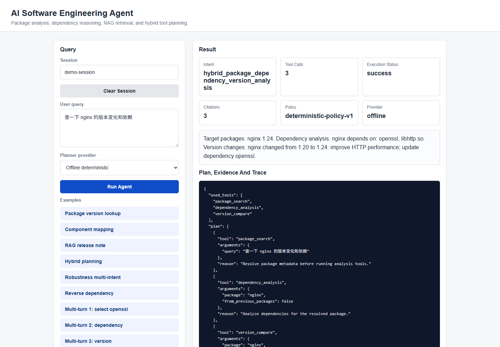
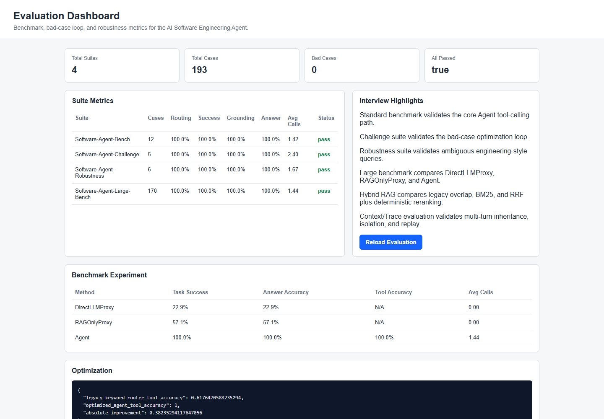
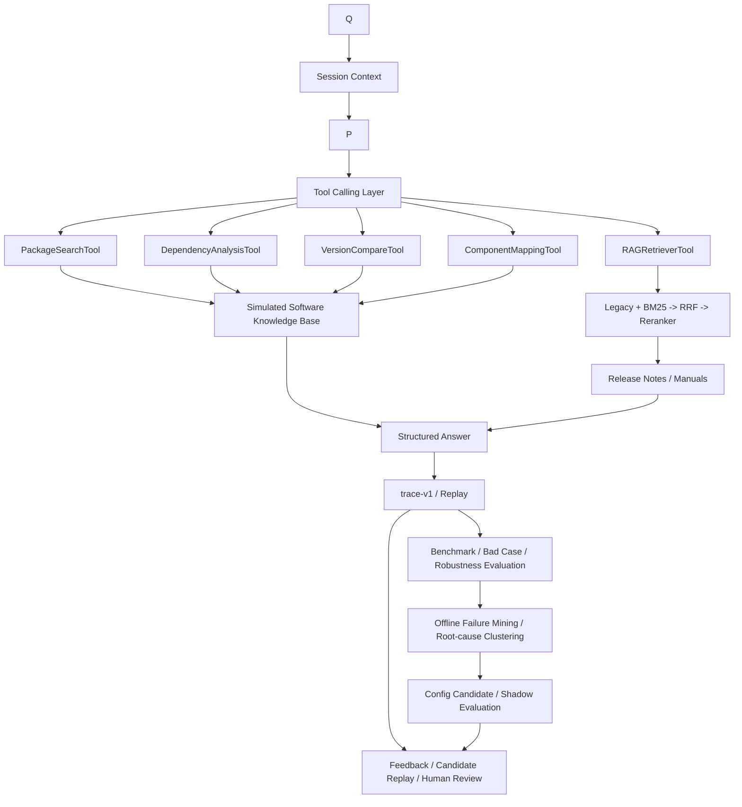

# AI Software Engineering Agent

[](https://github.com/Isoldelu/software-engineering-agent/actions/workflows/ci.yml)

A reproducible AI4SE demo for software asset retrieval and analysis, built with simulated data, multi-tool Agent planning, RAG retrieval, trajectory logging, and benchmark experiments.

This project does not contain, copy, or depend on internal enterprise data. It uses public-style simulated software asset data to reproduce the Agent methodology in a compliant way.

## At A Glance

| Layer | Capability |
|---|---|
| Agent | Deterministic/optional LLM planning, five tools, hybrid workflows, multi-turn context |
| Knowledge | Structured software assets plus Legacy/BM25/Hybrid RAG |
| Trust | Evidence, Citation, Verifier, partial success, replayable privacy-bounded Trace |
| Optimization | Benchmark, Bad Case loop, offline candidate generation, human review |
| Delivery | Policy versioning, gray rollout, rollback, FastAPI, Docker, PostgreSQL |
| Operations | Auth, Key rotation, Audit, retention, pooling, Prometheus, backup/restore |

## Verified Evidence

| Gate | Result |
|---|---:|
| Automated tests | 131 passed |
| Frozen evaluation baseline | 193 compatible cases |
| Real PostgreSQL initial load | 100/100, 0 server errors |
| Load after Worker replacement | 40/40, 0 server errors |
| Transaction/lease fault injection | 6/6 passed |
| Database outage recovery | readiness 503 -> 200 |

Current evidence: [GitHub Actions Run 33309988987](https://github.com/Isoldelu/software-engineering-agent/actions/runs/33309988987). The frozen v1.0.0 evidence remains available in the [release summary](release/v1.0.0-evidence.json).

## Try It

```bash
python -m pip install -r requirements-runtime.txt
python main.py "1214 release packages and their dependencies"
```

Run the API:

```bash
uvicorn app.api.server:app --host 127.0.0.1 --port 8000
```

Then open `http://127.0.0.1:8000/demo` or call `POST /agent/query`.

## Interview-Ready Package

- [One-page project showcase](docs/project-showcase.md)
- [2-3 minute demo runbook](docs/demo-runbook.md)
- [Executable API demo](examples/interview_demo.py)
- [Interview talking points and Q&A](docs/interview_talking_points.md)
- [v1.0.0 release evidence](release/v1.0.0-evidence.json)

With the API running:

```bash
python examples/interview_demo.py --skip-evaluation
```

### Demo Preview





## Highlights

- Multi-tool Agent with hybrid planning across structured tools and RAG.
- Stable Evidence/Citation, deterministic verification, replay, and partial-success semantics.
- Controlled Feedback and offline self-evolution that stop at human review.
- Versioned policy rollout, monitoring, rollback, and exact Trace attribution.
- Real PostgreSQL multi-Worker CI with fault injection and retained evidence.
- Zero-cost offline default; real online Provider calls require explicit credentials and budget.

## Results

Evaluation summary:

```text
suite_count: 4
total_cases: 193
total_bad_cases: 0
all_suites_passed: true
```

Large benchmark:

```text
total: 170
tool_routing_accuracy: 100.00%
task_success_rate: 100.00%
answer_grounding_accuracy: 100.00%
answer_accuracy: 100.00%
```

Baseline comparison:

| Method | Task Success | Answer Accuracy | Tool Accuracy |
|---|---:|---:|---:|
| DirectLLMProxy | 22.94% | 22.94% | N/A |
| RAGOnlyProxy | 57.06% | 57.06% | N/A |
| Agent | 100.00% | 100.00% | 100.00% |

Optimization experiment:

| Method | Tool Accuracy |
|---|---:|
| LegacyKeywordRouter | 61.76% |
| OptimizedAgent | 100.00% |

Absolute improvement: `+38.24%`

Hybrid RAG ablation (30 labeled cases):

| Mode | Recall@3 | Recall@5 | MRR | No-answer |
|---|---:|---:|---:|---:|
| Legacy | 83.33% | 83.33% | 79.17% | 100% |
| BM25 | 100% | 100% | 95.83% | 100% |
| Hybrid | 100% | 100% | 95.83% | 100% |

Context/Trace evaluation: entity consistency `100%`, cross-session leaks `0`, Trace completeness `100%`, replay input reconstruction `100%`.

Controlled Feedback experiment: linked routing accuracy `0% -> 100%`, 3 bad cases fixed, 193 regression cases with 0 regressions, candidate remains `pending_review` and inactive.

Policy rollout experiment: a reviewed candidate was released at 20%; 184 of 1,000 stable-hash session assignments entered rollout (18.4%). Injected rollout failures triggered automatic rollback to `deterministic-policy-v1` with Agent source hashes unchanged.

Provider dual-mode experiment: 12 representative queries reached 100% Offline/Mock-Online plan parity. Malformed JSON, unknown Tool, and timeout injections achieved 100% deterministic fallback, with provider metadata retained in Trace and 0 paid API calls.

Offline evolution experiment: 9 failures were mined into Router, Query Alias, and Retriever clusters. Three configuration candidates fixed all 9 linked cases with 0 regressions and remained `pending_review + active=false`; paid API calls were 0.

Control-plane experiment: two independent Store/Repository instances passed all 13 persistence, API role, CAS, lease, Session, Trace, Feedback, Evolution, and Policy consistency gates. Concurrent Policy creation produced unique v2/v3 versions. SQLite WAL is used for local validation; PostgreSQL 16 is the deployment backend configured in Compose and CI.

Step 27 local operations experiment: 60/60 concurrent requests succeeded across two observed Uvicorn Workers with 0 server errors. After one Worker was killed, its replacement was observed and the recovery load passed 40/40. Migration, Key rotation, Audit, retention, CAS/lease, and transaction rollback gates passed. Real PostgreSQL load and database outage gates are configured in CI and remain pending execution on this disk-constrained workstation.

Step 28 local disaster-recovery drill verified, deleted, and restored 2/2 control-plane records from a SHA-256 logical backup. GitHub Actions Run `32742656550` then passed all test, Docker, and PostgreSQL jobs. Real PostgreSQL load completed 100/100 requests across two Workers with 0 server errors; after one Worker was killed and replaced, recovery load completed 40/40. Pool, Prometheus multiprocess, independent Audit, backup/restore, and database outage recovery gates all passed.

The baselines are offline proxy baselines. They are used to avoid paid LLM API costs and nondeterministic outputs while keeping experiments reproducible.

## Architecture



## Core Workflow

```text
Query
-> Session Context Resolution
-> Intent Routing
-> Tool Selection
-> Tool Execution
-> Evidence Collection
-> Structured Answer
-> Evidence/Verification
-> trace-v1 Recording And Replay
-> Evaluation
```

Example hybrid task:

```text
1214 release packages and their dependencies
-> RAGRetrieverTool
-> PackageSearchTool
-> DependencyAnalysisTool
```

Example robustness task:

```text
查一下 nginx 的版本变化和依赖
-> PackageSearchTool
-> DependencyAnalysisTool
-> VersionCompareTool
```

## Tools

| Tool | Purpose |
|---|---|
| PackageSearchTool | Search package metadata by package name or release id |
| DependencyAnalysisTool | Analyze direct and reverse dependencies |
| VersionCompareTool | Compare package version changes |
| ComponentMappingTool | Map binary/shared library files to owner packages |
| RAGRetrieverTool | Retrieve evidence from release notes and manuals |

## Project Structure

```text
Software-Agent/
  app/
    agent/
    api/
    feedback/
    policy/
    providers/
    rag/
    tools/
  data/
    documents/
    dependencies.json
    packages.json
    versions.json
  docs/
    api-contract.md
    architecture-v2.md
    experiment_results.md
    interview_talking_points.md
    project_summary.md
    resume_version.md
  evaluation/
    baseline-v1.json
    baseline.py
    large_benchmark.json
    eval_runner.py
    experiment_runner.py
  examples/
  tests/
  main.py
  requirements.txt
  requirements-runtime.txt
  requirements-dev.txt
  requirements-online.txt
  Dockerfile
  docker-compose.yml
```

## Quick Start

Install runtime dependencies:

```bash
pip install -r requirements-runtime.txt
```

For tests and static checks use `pip install -r requirements-dev.txt`.

Online planning is optional. Install `requirements-online.txt`, set `SOFTWARE_AGENT_ENABLE_ONLINE_LLM=true`, and provide `OPENAI_API_KEY` only when running an explicitly budgeted real-provider experiment. Default operation remains offline.

Run a command-line query:

```bash
python main.py "1214 release packages and their dependencies"
```

Run the FastAPI service:

```bash
uvicorn app.api.server:app --reload
```

`SOFTWARE_AGENT_POLICY_STATE_PATH` can override the default `data/policy_state.json` location for read-only or externally mounted deployments.

Open:

```text
http://127.0.0.1:8000/demo
http://127.0.0.1:8000/evaluation-dashboard
```

## API

```text
GET  /demo
GET  /evaluation-dashboard
GET  /health
GET  /ready
GET  /auth/status
GET  /auth/keys
POST /auth/keys/rotate
POST /auth/keys/{key_id}/revoke
GET  /audit/events
GET  /storage/status
GET  /metrics
GET  /maintenance/retention/policy
POST /maintenance/retention/run
POST /agent/query
POST /agent/query-with-plan
POST /agent/query-provider
GET  /providers/status
POST /evolution/scan
GET  /evolution/state
POST /evolution/candidates/{candidate_id}/shadow-evaluate
POST /evolution/candidates/{candidate_id}/review
POST /evolution/candidates/{candidate_id}/activate  # always blocked
GET  /sessions/{session_id}
DELETE /sessions/{session_id}
GET  /traces/{trace_id}
GET  /traces/{trace_id}/replay-input
POST /traces/{trace_id}/replay
POST /feedback
GET  /feedback
POST /candidates/propose
GET  /candidates
GET  /policies
POST /policies/from-candidate/{candidate_id}
POST /policies/{policy_id}/rollout
POST /policies/{policy_id}/promote
POST /policies/{policy_id}/rollback
POST /policies/{policy_id}/monitor
GET  /evaluation/policy
GET  /evaluation/provider
GET  /evaluation/evolution
GET  /evaluation/control-plane
POST /candidates/{candidate_id}/evaluate
POST /candidates/{candidate_id}/review
POST /candidates/{candidate_id}/activate  # blocked until Step 23
GET  /evaluation/run
GET  /evaluation/summary
GET  /evaluation/bad-cases
GET  /evaluation/robustness
GET  /evaluation/experiment
GET  /evaluation/evidence
GET  /evaluation/verifier
GET  /evaluation/rag
GET  /evaluation/context
GET  /evaluation/feedback
GET  /tools
GET  /function-specs
```

Example request:

```bash
curl -X POST http://127.0.0.1:8000/agent/query ^
  -H "Content-Type: application/json" ^
  -d "{\"query\":\"1214 release packages and their dependencies\",\"persist_trajectory\":false}"
```

## Evaluation

Run standard benchmark:

```bash
python evaluation/eval_runner.py
```

Run challenge suite:

```bash
python evaluation/eval_runner.py --suite challenge
```

Run robustness suite:

```bash
python evaluation/eval_runner.py --suite robustness
```

Run large benchmark:

```bash
python evaluation/eval_runner.py --suite large
```

Run baseline and optimization experiment:

```bash
python evaluation/eval_runner.py --suite experiment
```

Run all suites:

```bash
python evaluation/eval_runner.py --suite all
```

Run Evidence/Citation evaluation across all 193 cases:

```bash
python evaluation/eval_runner.py --suite evidence
```

Run injected-error and partial-success Verifier evaluation:

```bash
python evaluation/eval_runner.py --suite verifier
```

Run the labeled Legacy/BM25/Hybrid RAG ablation:

```bash
python -B evaluation/eval_runner.py --suite rag
```

The runtime default remains `legacy` for Step 17 compatibility. Enable Hybrid before starting CLI/API with `SOFTWARE_AGENT_RAG_MODE=hybrid`.

Run the multi-turn Context and enhanced Trace evaluation:

```bash
python -B evaluation/eval_runner.py --suite context
```

Run the controlled Feedback and candidate replay experiment:

```bash
python -B evaluation/eval_runner.py --suite feedback
```

Run offline failure mining, clustering, and shadow candidate evaluation:

```bash
python -B evaluation/eval_runner.py --suite evolution
```

This Step 25 cycle uses no external Provider. It can propose Router Rule, Query Alias, and Retriever Weight configurations, but every passing candidate stops at human review and cannot self-activate.

Run persistence, authorization, and multi-worker consistency evaluation:

```bash
python -B evaluation/eval_runner.py --suite control-plane
```

For shared deployment, configure `SOFTWARE_AGENT_DATABASE_URL` with PostgreSQL and enable reader/operator/admin API Keys. See the control-plane design document before enabling multiple workers.

### Step 17 Compatibility Baseline

Verify that the current API, Tool, Workflow, and 193-case evaluation behavior remains compatible:

```bash
python -B evaluation/baseline.py --check
```

Run contract and Workflow golden tests:

```bash
python -B -m pytest -q -p no:cacheprovider
```

Only rewrite the baseline after an intentional, reviewed behavior change:

```bash
python -B evaluation/baseline.py --write
```

The baseline normalizes the local project path while preserving routing decisions, tool order, answers, evidence, trajectories, and evaluation metrics.

## Documentation

- [Project Showcase](docs/project-showcase.md)
- [2-3 Minute Demo Runbook](docs/demo-runbook.md)
- [Project Summary](docs/project_summary.md)
- [Architecture V2 Baseline](docs/architecture-v2.md)
- [API Contract V1](docs/api-contract.md)
- [Evidence and Citation](docs/evidence-citation.md)
- [Verifier and Partial Success](docs/verifier-partial-success.md)
- [Experiment Results](docs/experiment_results.md)
- [Interview Talking Points](docs/interview_talking_points.md)
- [Resume Version](docs/resume_version.md)
- [Agent Benchmark Experiment](evaluation/agent_benchmark_experiment.md)
- [Bad Case Report](evaluation/bad_case_report.md)
- [Robustness Report](evaluation/robustness_report.md)
- [Evidence/Citation Report](evaluation/evidence_report.md)
- [Verifier Report](evaluation/verifier_report.md)
- [Hybrid RAG Design](docs/hybrid-rag.md)
- [Hybrid RAG Report](evaluation/hybrid_rag_report.md)
- [Context And Trace Design](docs/context-trace.md)
- [Context And Trace Report](evaluation/context_trace_report.md)
- [Controlled Feedback Design](docs/controlled-feedback-loop.md)
- [Controlled Feedback Report](evaluation/controlled_feedback_report.md)
- [Offline Controlled Evolution Design](docs/offline-controlled-evolution.md)
- [Offline Controlled Evolution Report](evaluation/offline_evolution_report.md)
- [Control-plane Persistence And Auth](docs/control-plane-persistence-auth.md)
- [Control-plane Evaluation Report](evaluation/control_plane_report.md)

## Compliance Note

This repository is a personal reproduction project based on simulated software asset data. It should be described separately from any real professional experience:

```text
Professional experience:
Participated in software asset retrieval, parsing automation, and Agent tooling exploration in a network device R&D environment.

Personal reproduction project:
Built a simulated-data Software Engineering Agent prototype to validate Agent methodology.
```

## Roadmap

- Run a budget-capped real Provider A/B for plan validity, task success, latency, tokens, and cost
- Add an external public software-asset evaluation set to measure out-of-distribution behavior
- Add production alert rules and a longer PostgreSQL capacity/soak experiment
- Evaluate whether FAISS or a managed vector store improves retrieval beyond the current small corpus
