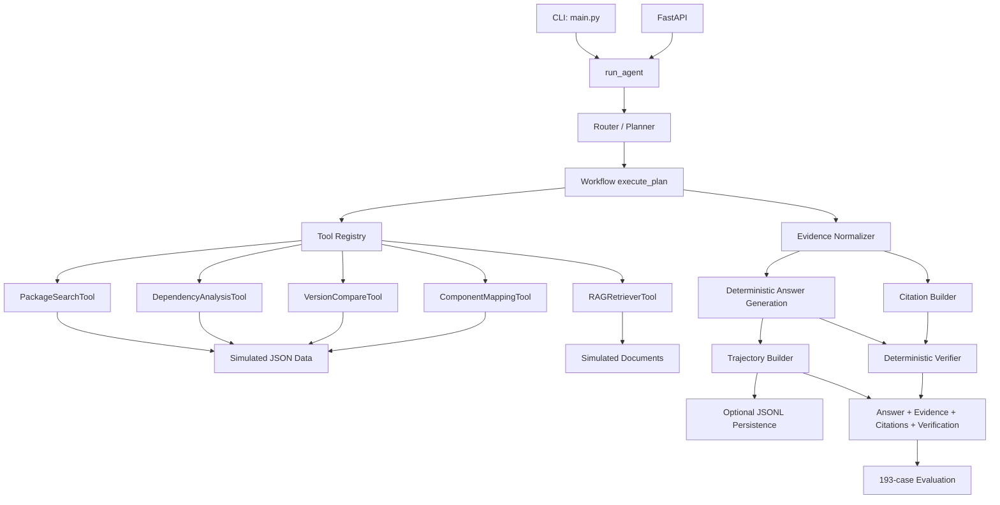

# Software-Agent Architecture V2 Baseline

## 1. 文档目的

本文以 Step 17 兼容基线为起点，并记录 Step 18 已接入主链路的 Evidence/Citation 扩展。Verifier、Context 和 Policy 仍属于后续阶段。

当前基线版本：`baseline-v1`。

## 2. 当前架构



## 3. 主执行链

```text
Query
-> build_plan()
-> execute_plan()
-> Tool.run()
-> generate_final_answer()
-> build_trajectory()
-> optional TrajectoryMemory.append()
-> Agent response
```

单工具任务执行一个 Tool。Hybrid 任务按 Planner 给出的步骤顺序执行多个 Tool，并允许 PackageSearchTool 的包列表驱动后续 Dependency 或 Version Tool。

## 4. 当前模块职责

| 模块 | 当前职责 | Step 17 兼容边界 |
|---|---|---|
| `app/agent/router.py` | 识别意图和首选工具 | 不改变现有路由结果 |
| `app/agent/planner.py` | 生成单步或多步计划 | 不改变现有步骤顺序 |
| `app/agent/workflow.py` | 执行工具、生成答案和轨迹 | 保持 `run_agent()` 返回字段 |
| `app/tools/` | 查询模拟结构化数据和文档 | 保持 `run(query)` 与公共字段 |
| `app/rag/` | Chunk 与轻量词元检索 | Step 17 不升级检索算法 |
| `app/evidence/` | Evidence/Citation 模型、标准化与完整性校验 | 只新增字段，不改变 V1 字段语义 |
| `app/agent/verifier.py` | 在线规则校验、四态聚合与一次答案修复 | 不重新规划或重复调用 Tool |
| `app/rag/` | 标准 Chunk、BM25、RRF 和确定性 Reranker | 默认 Legacy 保护 V1，可配置启用 Hybrid |
| `app/agent/context.py` | Session 隔离、任务实体继承和容量限制 | 只保存 package/release/component 等任务上下文 |
| `app/agent/trace.py` | trace-v1、步骤延迟、父子链和 Replay | 不记录内部 Thought |
| `app/feedback/` | Feedback 关联、归因、配置候选、隔离回放和人工审核 | 不修改源码，不自动激活 |
| `app/api/` | FastAPI、Demo 和评测接口 | 保持既有路径与响应字段 |
| `evaluation/` | 四套评测和 baseline 实验 | 冻结 193 条结果 |
| `tests/contracts/` | Tool/API 行为契约 | 检查字段、状态和语义 |
| `tests/golden/` | 代表性 Workflow 快照 | 检查完整确定性输出 |

## 5. Step 17 新增保护层

```text
Current implementation
  -> Contract tests
  -> Workflow Golden tests
  -> 193-case baseline snapshot
  -> Machine-readable baseline diff
```

`evaluation/baseline.py` 会规范化项目绝对路径。Step 18 后采用递归向后兼容比较：V1 的键和值必须保持一致，允许新增 Evidence/Citation 字段；`generated_at` 和运行环境只保存在 metadata 中，不参与行为比较。

### Step 18 Evidence 扩展

```text
Tool.run()
-> execute_tool_call()
-> EvidenceNormalizer
-> legacy fields + normalized_observation
-> Workflow evidence_id deduplication
-> Citation generation
-> API / Demo / trajectory / memory
```

具体 Schema 和来源映射见 `docs/evidence-citation.md`。

### Step 19 Verifier 扩展

```text
Draft Answer + Plan + Observations + Evidence + Citations
-> 11 deterministic rules
-> pass, or one answer-only recomposition
-> execution_status + verification
```

具体规则与四态语义见 `docs/verifier-partial-success.md`。

### Step 20 Hybrid RAG 扩展

```text
Markdown -> standard Chunk
-> Legacy/BM25 candidate retrieval
-> RRF fusion -> deterministic reranker
-> ranked Chunk + score breakdown
-> Evidence/Citation
```

详细参数、切换方式和消融结果见 `docs/hybrid-rag.md`。

### Step 21 Context/Trace 扩展

```text
session_id -> AgentContext -> resolved query -> Agent workflow
-> context update -> trace-v1 -> in-memory/optional JSONL -> Replay
```

旧 trajectory 继续用于 V1 兼容；新审计和后续 Feedback 使用 trace-v1。详细 Schema、容量与隐私边界见 `docs/context-trace.md`。

### Step 22 受控 Feedback 扩展

```text
trace-v1 -> Feedback Observer -> Classifier
-> same-fingerprint threshold -> Router Hook Candidate
-> linked replay + 193-case regression + latency gates
-> pending_review -> human review -> approved but inactive
```

当前 Candidate 不进入 `run_agent()` 默认策略。激活端点明确阻断，等待 Step 23 的策略版本、灰度和回滚能力。详见 `docs/controlled-feedback-loop.md`。

### Step 23 策略发布与工程交付扩展

```text
approved Candidate -> immutable policy_vN -> schema validation
-> SHA-256 session cohort (stable / rollout)
-> Workflow + trace-v1 policy attribution
-> control/rollout monitor
-> promote OR automatic/manual rollback to parent
```

策略状态默认持久化到 `data/policy_state.json`。灰度和回滚只修改 Policy Repository 状态，不改 Router、Planner 或 Workflow 源码。运行时依赖、开发依赖、Docker、CI 和 Smoke Evaluation 分层交付，详见 `docs/policy-rollout.md`。

### Step 24 可选 Provider 与双模式扩展

```text
query -> PlannerGateway -> Offline Provider (default)
                       -> OpenAI Responses Provider (explicit opt-in)
-> Structured Plan validation -> existing Agent Workflow
-> Tool -> Evidence -> Verifier -> Trace(provider/model/usage/fallback)
```

Provider 只拥有 Plan 提议权，不拥有 Tool 执行权。缺 Key、在线未启用、超时、API 错误、Malformed JSON 和未知 Tool 都在 Gateway 边界被阻断；允许 fallback 时切回 Offline Planner，否则 fail-closed 且不执行 Tool。详见 `docs/llm-provider.md`。

### Step 33 受审 Evolution-to-Policy 扩展

```text
approved Evolution Candidate + passed Shadow report
-> asset translator (rule / alias / retriever)
-> merge stable Policy config -> dual schema validation
-> Candidate + Config SHA-256 provenance
-> idempotent immutable Bridge record -> rollout policy_vN
-> stable session assignment -> runtime effect -> promote/rollback
```

Policy Engine 在规划前应用 Alias，在 Planner 前匹配版本化 Router Rule，并把 Retriever 配置注入 RAG Tool。相同 Candidate 和相同灰度参数重放不创建新版本；参数漂移、未审批或 Shadow 未通过均拒绝。候选自激活接口仍然关闭，详见 `docs/reviewed-evolution-policy-bridge.md`。

## 6. 兼容规则

- `/agent/query` 已有字段必须继续存在并保持语义。
- 新字段应采用可选字段或新版本响应模型，不能复用旧字段表达不同含义。
- Tool 必须继续提供 `tool`、`status`、`query` 和 `evidence`。
- 现有状态值在 Step 18/19 扩展前保持原义。
- Hybrid Tool 顺序属于当前行为契约，改变顺序必须说明原因并更新评测。
- 不应手工修改 `baseline-v1.json` 来掩盖回归。
- 只有在确认行为变更是预期变化、测试和文档同步更新后，才可以显式执行 `--write` 生成新基线版本。

## 7. 基线复现

生成基线：

```bash
python -B evaluation/baseline.py --write
```

验证兼容性：

```bash
python -B evaluation/baseline.py --check
```

运行全部测试：

```bash
python -B -m pytest -q -p no:cacheprovider
```

禁用 pytest 缓存是为了兼容当前 Windows 中文路径和受限写入环境，不影响测试内容。

## 8. 已冻结结果

```text
Evaluation suites: 4
Evaluation cases: 193
Bad cases: 0
Tool routing accuracy: 100%
Task success rate: 100%
Answer grounding accuracy: 100%
Answer accuracy: 100%
Contract and Golden tests: 24 passed
```

这些结果适用于当前模拟数据和离线确定性评测，不代表真实线上数据或外部 LLM 的效果。
