# Software Engineering Agent: Project Showcase

## One-Sentence Positioning

A reproducible AI4SE Agent that combines deterministic software-engineering tools,
Hybrid RAG, evidence-grounded verification, controlled optimization, and an operable
FastAPI/PostgreSQL control plane using only simulated data.

## System Architecture

```mermaid
flowchart LR
    U["User / API Client"] --> API["FastAPI Service"]
    API --> CTX["Session Context"]
    CTX --> PLAN["Router + Hybrid Planner"]
    PLAN --> TOOLS["Five Agent Tools"]
    TOOLS --> STRUCT["Package / Dependency / Version / Component Data"]
    TOOLS --> RAG["BM25 + Legacy + RRF + Reranker"]
    STRUCT --> EVID["Evidence + Citation"]
    RAG --> EVID
    EVID --> VERIFY["Deterministic Verifier"]
    VERIFY --> ANSWER["Success / Partial Success / Failure"]
    ANSWER --> TRACE["Replayable Trace"]
    TRACE --> EVAL["193-Case Evaluation"]
    TRACE --> FEEDBACK["Feedback + Bad-case Mining"]
    FEEDBACK --> CAND["Configuration Candidate"]
    CAND --> SHADOW["Shadow Evaluation"]
    SHADOW --> REVIEW["Human Review"]
    REVIEW --> POLICY["Versioned Gray Rollout / Rollback"]
    POLICY --> PLAN
    API --> CTRL["PostgreSQL Control Plane"]
    CTRL --> OPS["Auth / Audit / Retention / Metrics / Backup"]
```

## Why It Is More Than RAG

| Question type | Best execution path | Reason |
|---|---|---|
| Package metadata | `PackageSearchTool` | Structured exact lookup |
| Dependency reasoning | `DependencyAnalysisTool` | Graph-style forward/reverse relation |
| Version change | `VersionCompareTool` | Deterministic field comparison |
| Ownership mapping | `ComponentMappingTool` | Structured component ownership |
| Manual/release-note query | `RAGRetrieverTool` | Unstructured evidence retrieval |
| Compound query | Hybrid Planner and multiple tools | Decomposition and result composition |

The frozen proxy comparison supports this design choice: DirectLLMProxy achieved 22.94%
task success, RAGOnlyProxy 57.06%, and the Agent 100% on the simulated benchmark. These
are offline proxy results, not measurements of a paid online model.

## Verified Evidence

| Gate | Verified result |
|---|---:|
| Automated tests | 134 passed |
| Frozen evaluation | 193/193 compatible |
| Legacy to optimized routing | 61.76% to 100% |
| PostgreSQL initial load | 100/100, zero server errors |
| Load after Worker replacement | 40/40, zero server errors |
| Fault-injection gates | 6/6 passed |
| Database outage recovery | readiness 503 to 200 |
| Backup/restore | 2/2 records restored |
| Paid Provider calls | 0 |

Current evidence is bound to
[GitHub Actions Run 33311037079](https://github.com/Isoldelu/software-engineering-agent/actions/runs/33311037079).
The frozen v1.0.0 evidence remains in [`release/v1.0.0-evidence.json`](../release/v1.0.0-evidence.json).

## Three-Minute Demo Path

1. Open `/demo` and submit `查一下 nginx 的版本变化和依赖`.
2. Show the planned tool chain, Evidence/Citation, Verifier status, and Trace ID.
3. Open `/evaluation-dashboard` and show the frozen evaluation and baseline comparison.
4. Open the green GitHub Actions Run and explain the PostgreSQL Worker-recovery gate.
5. Close with the compliance boundary: all asset data is simulated and online Provider A/B
   was intentionally deferred because no API budget was approved.

Detailed commands and fallback steps are in [`demo-runbook.md`](demo-runbook.md).

## Engineering Decisions

- Deterministic local execution is the default so results are reproducible and zero-cost.
- Optional Provider plans are schema-validated before tools execute; malformed output falls
  back or fails closed.
- Tool output becomes structured Evidence and Citation before answer generation.
- Verifier failures produce partial-success semantics instead of silently presenting an
  incomplete answer as fully correct.
- Feedback can create configuration candidates, but source mutation and automatic activation
  are blocked; shadow evaluation and human review are mandatory.
- Session, Trace, Feedback, Policy, Key Registry, and Audit state can be shared across multiple
  Workers through PostgreSQL with CAS and leases.

## Honest Boundaries

- The project is a personal methodology reproduction, separate from professional experience.
- It contains no internal enterprise data; package, dependency, version, component, and document
  records are simulated.
- The benchmark is deterministic and project-specific, so 100% does not imply general-domain
  intelligence.
- GitHub-hosted load numbers are functional deployment evidence, not a production SLA.
- Real Provider quality, token usage, latency, and cost remain unmeasured until an explicit API
  key and budget are provided.
