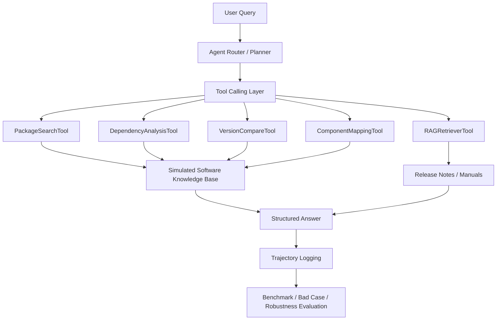

# Project Summary

## Project Name

AI Software Engineering Agent

## Positioning

This project is a compliant AI4SE demo based only on public or simulated data. It reproduces the methodology of a software engineering Agent without using or copying any internal enterprise data.

The system focuses on software asset query and analysis tasks:

- Package metadata lookup
- Dependency analysis
- Version comparison
- Component ownership mapping
- RAG retrieval over release notes and manuals
- Hybrid multi-tool planning
- Agent trajectory logging
- Stable structured Evidence and Citation for Tool facts
- Deterministic online verification and partial-success execution semantics
- Hybrid RAG with BM25, RRF, deterministic reranking, and stable Chunk IDs
- Session-scoped multi-turn Context and privacy-bounded replayable Trace
- Controlled Trace-linked Feedback and human-reviewed configuration candidates
- Versioned policy release, deterministic gray rollout, monitoring, and rollback
- Optional real LLM planning provider with offline/online dual-mode evaluation
- Offline failure mining, root-cause clustering, and human-gated shadow candidates
- Reviewed Evolution-to-Policy translation, immutable provenance, idempotent rollout, and rollback
- Shared PostgreSQL-ready control-plane persistence and role-aware API authentication
- Benchmark evaluation and bad-case optimization

## Architecture



## Core Design

The Agent follows this workflow:

```text
Query -> Intent Routing -> Tool Selection -> Tool Execution -> Evidence -> Answer -> Evaluation
```

The project keeps deterministic local tools so evaluation is reproducible, while also exposing prompt and function schema layers for future LLM Router or Function Calling integration.

## Evaluation Layers

The project has four evaluation layers:

```text
Software-Agent-Bench: standard tool-calling benchmark
Software-Agent-Challenge: bad-case optimization suite
Software-Agent-Robustness: ambiguous engineering-query suite
Software-Agent-Large-Bench: 170-case experiment benchmark
```

Step 20 adds a separate 30-case labeled RAG benchmark comparing Legacy, BM25, and Hybrid retrieval. Hybrid reaches 100% Recall@3/5, 95.83% MRR, 100% no-answer accuracy, and 100% Citation correctness on the simulated corpus.

Step 21 adds 8 multi-turn conversations and 5 isolation probes. Entity consistency, Trace completeness, and replay input reconstruction are 100%, with zero cross-session leaks.

Step 22 adds a controlled optimization experiment. Three Trace-linked `wrong_tool` records generate a Router Hook candidate that improves linked routing from 0% to 100%, fixes 3 bad cases, and keeps all 193 frozen regression cases unchanged. The candidate stops at `pending_review` and cannot be activated before Step 23.

Step 23 adds controlled delivery. An approved candidate becomes an immutable policy version, 20% of sessions are selected by stable SHA-256 assignment, each Trace records its exact policy, and control/rollout metrics can automatically restore the parent policy. The evaluation observed an 18.4% rollout cohort over 1,000 sessions and completed rollback without changing Agent source hashes.

Engineering delivery is split into runtime/development dependencies, Docker and Compose, GitHub Actions gates, a CI smoke benchmark, and release/rollback runbooks.

Step 24 keeps the deterministic planner as the zero-cost default and adds an optional OpenAI Responses structured-plan adapter. Provider outputs are locally validated before execution; missing credentials, timeout, malformed JSON, API errors, and unknown tools safely fall back or fail closed. A 12-case Mock Online evaluation reaches 100% plan parity and fallback success with zero paid calls.

Step 25 adds offline controlled self-evolution without requiring a Provider. The miner discovers 9 reproducible failures and clusters Router, Query Alias, and Retriever ranking causes into 3 configuration candidates. Shadow evaluation fixes all 9 linked cases with zero regressions across the corresponding 193-case Agent and 30-case RAG suites. Every candidate stops at `pending_review`; source editing and automatic activation remain blocked.

Step 26 adds a shared control plane for Session, Trace, Feedback, Evolution, and Policy records. Revision-based compare-and-swap prevents stale writes; database leases serialize Policy mutation and Evolution scans. API Key roles separate read, execution, and approval/release permissions. Local SQLite WAL tests use two independent Store instances and pass all 13 consistency gates, while PostgreSQL 16, two Uvicorn workers, readiness, and a real-database CI smoke are configured for deployment.

Step 27 adds production operations around that control plane. Three versioned migrations are protected by checksums and a PostgreSQL advisory lock. API Keys can be rotated or revoked through a shared hashed Registry, protected actions create redacted Audit events, and configurable bounded retention covers Session, Trace, Feedback, Evolution, and Audit data. Local two-Worker load passed 60/60 requests; after killing one Worker, its replacement passed 40/40 recovery requests. Real PostgreSQL load, Worker recovery, and database stop/readiness/restart gates are implemented in CI and remain pending execution outside this disk-constrained workstation.

Step 28 adds per-Worker PostgreSQL connection pools, official Prometheus multiprocess metrics with a constant-memory local fallback, an independent redacted JSONL Audit outlet, and checksum-protected logical backup/restore. The local recovery drill restored 2/2 records and rejected a corrupted snapshot. GitHub Actions Run `32742656550` passed 128 tests plus Docker and PostgreSQL jobs: 100/100 initial and 40/40 post-Worker-kill requests succeeded with zero server errors; Pool, Audit, Metrics, backup/restore, and database stop/recovery gates passed. The evidence is retained in the v1.0.0 Release and Actions artifact.

Step 29 packages the project as a reproducible v1.0.0 release with open-source governance,
public-risk audit, release notes, machine-readable evidence, and a fixed evidence asset. A real
release-candidate latency-gate failure was diagnosed and fixed with median statistics plus a bounded
noise floor instead of being hidden by a retry.

Step 30 provides an interview delivery layer: a one-page architecture and evidence showcase, a
2-3 minute demo runbook, an executable API demo client, current interview Q&A, and browser-verified
screenshots. GitHub Actions Run `33314875879` passed 138 tests plus Docker and PostgreSQL jobs.
This layer changes presentation, not the frozen Agent behavior.

Step 33 closes the previously explicit Evolution/Policy gap. A human-approved, Shadow-passed
Router, Query Alias, or Retriever candidate is translated into the shared Policy schema, merged
with the stable configuration, bound to Candidate/Config SHA-256 digests, and released through an
immutable idempotent Bridge record. Runtime Policy assignment now applies all three asset types;
manual or monitored rollback restores the parent version and synchronizes the source candidate.
The Agent still cannot approve or activate itself. GitHub Actions Run `33354020784` passed the
150-test suite plus Docker and real PostgreSQL integration jobs.

Step 34 validates that reviewed releases remain consistent under multi-Worker contention and
partial persistence failures. Twenty concurrent HTTP release requests across two Uvicorn Workers
converged on one Policy and one Bridge; a fail-once repository exposed the Policy-before-Bridge
window and verified retry compensation without a duplicate Policy. Competing candidates, rollout
promote/rollback races, audit retention, and protected release-ledger namespaces are also gated.
Local database and HTTP experiments passed 16/16 and 14/14 gates respectively. GitHub Actions Run
`33363220127` passed the 155-test, Docker, and PostgreSQL jobs; both Step 34 PostgreSQL steps passed
and Artifact `software-agent-step34-bridge-evidence` retained their reports.

Step 35 adds an explicit-budget DeepSeek V4 Flash Planner through a dedicated Provider adapter.
JSON Output is followed by the existing local Plan validator and deterministic fallback; credentials
remain process-local and are excluded from Trace, Audit, reports, and Git. An initial real response
exposed string-valued arguments and speculative Tool selection, so the Prompt contract added object
arguments, minimal-plan rules, and release-package fan-out. The optimized 20-case run reached 100%
structured-plan validity, 100% human-labeled required Tool coverage, 95% strict task success, zero
fallback, 2.276-second P95 latency, and a $0.011726 peak-price cost upper bound.
GitHub Actions Run `33375239707` then passed 160 tests plus Docker and PostgreSQL jobs on the same
commit. The CI workflow has no Provider credential and does not invoke the explicit paid runner.

Step 36 adds a bounded DeepSeek Native Tool Calling loop and compares it with the deterministic and
JSON planning paths on 10 simulated queries. Real Bad Cases showed speculative over-calling and a
`not_found` loop. Minimal-tool prompting, duplicate-call blocking, and deterministic `not_found`
convergence improved Native task success from 90% to 100%, reduced average Tool calls from 2.4 to
1.7, P95 latency from 5.940 to 4.074 seconds, tokens by 11.13%, and the conservative run-cost upper
bound by 13.07%. The final report passed every Gate and contains no credential-shaped value.

Latest summary:

```text
suite_count: 4
total_cases: 193
total_bad_cases: 0
all_suites_passed: true
```

## Baseline Experiment

Offline proxy baselines are used to avoid paid LLM API cost and nondeterministic outputs:

```text
DirectLLMProxy task_success: 22.94%
RAGOnlyProxy task_success: 57.06%
Agent task_success: 100.00%
```

Optimization experiment:

```text
Legacy keyword router tool_accuracy: 61.76%
Optimized Agent tool_accuracy: 100.00%
Absolute improvement: +38.24%
```
